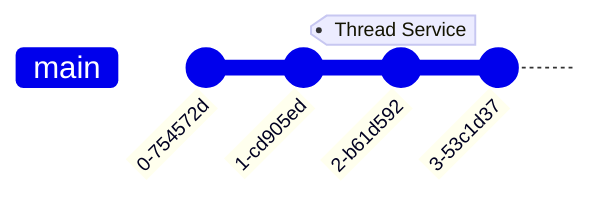

    commit
    branch develop
    checkout develop
    commit

    branch feature/mermaid
    checkout feature/mermaid
    commit
    checkout develop

    merge feature/mermaid
    commit
    checkout main
    merge develop tag: "v1.0.0"

    branch temp
    checkout temp
    commit

    checkout feature/mermaid
    merge temp tag: "test"